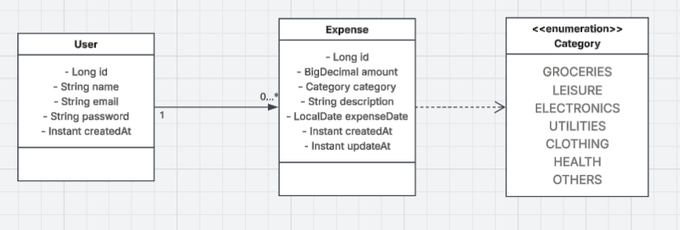

# HoneyMoney – Expense Tracker API (V2.1)

Creado: 28 de junio de 2026 10:25
Actualizado: 23 de julio de 2026
Etiquetas: APIs, Spring Boot

## Descripción

**HoneyMoney** es una API REST desarrollada con Spring Boot que permite a los usuarios gestionar sus gastos personales de manera segura y eficiente. La aplicación utiliza **PostgreSQL** como base de datos persistente (migrada desde H2 in-memory, usada originalmente en la Fase 1), un sistema de autenticación basado en JWT + Refresh Tokens, permitiendo sesiones seguras y renovables.

---

## Objetivo

Aplicar conceptos de backend para construir una API que permita a los usuarios gestionar sus gastos personales, implementando un sistema de autenticación robusto basado en access tokens de corta duración y refresh tokens para renovación de sesión.

---

## Funcionalidades

### Autenticación y usuarios

- Registro de usuarios.
- Login con emisión de:
  - Access Token (JWT)
  - Refresh Token
- Renovación de sesión mediante refresh token.
- Validación de JWT para proteger los endpoints.
- Identificación del usuario autenticado en cada petición.

---

### Gestión de gastos

#### Crear gasto

- Permitir registrar un nuevo gasto asociado al usuario autenticado con:
      - Monto
      - Categoría
      - Descripción (opcional)
      - Fecha

#### Consultar un gasto específico

- Obtener un gasto específico del usuario autenticado.

#### Listar gastos

- Obtener todos los gastos del usuario autenticado, de forma paginada.

#### Filtrar gastos

Permitir filtrar los gastos por:

- Rango de fechas predefinido: última semana, último mes, últimos 3 meses.
- Rango de fechas personalizado (`startDate` y `endDate`).
- Categoría (`category`), de forma independiente o combinada con cualquiera de los filtros de fecha anteriores.

#### Actualizar gasto

- Modificar un gasto existente, todos los campos son actualizables, exceptuando el id y el usuario propietario.

#### Eliminar gasto

- Eliminar un gasto existente.

#### Listar categorías disponibles

- Obtener el catálogo fijo de categorías soportadas por el sistema. Endpoint público, no requiere autenticación.

---

## Categorías de gastos

El sistema maneja las siguientes categorías predefinidas:

- Groceries
- Leisure
- Electronics
- Utilities
- Clothing
- Health
- Others

Las categorías se exponen a través de `GET /api/categories` y se usan además para validar los gastos creados/actualizados y como filtro en el listado de gastos.

---

## Restricciones técnicas

- JWT obligatorio para todos los endpoints protegidos, excepto:
  - `POST /api/auth/register`
  - `POST /api/auth/login`
  - `POST /api/auth/refresh`
  - `GET /api/categories`
  - la documentación de Swagger/OpenAPI (`/swagger-ui/**`, `/v3/api-docs/**`).
- Los access tokens tienen expiración corta (configurable).
- Los refresh tokens permiten renovar sesión sin reautenticación.
- El logout invalida el refresh token en servidor.
- Almacenamiento mediante **PostgreSQL (Supabase)**. Requiere la variable de entorno `PASS_DB` con la contraseña de la base de datos.
- Formato de fecha estándar para toda la API: `AAAA-MM-DD` (ISO 8601, ej. `2026-07-04`).
- Aislamiento de datos por usuario autenticado.
- Paginación disponible en `GET /api/expenses` mediante los parámetros estándar de Spring Data (`page`, `size`). Por defecto: `page=0`, `size=10`.
- Filtro por categoría disponible mediante el parámetro `category`, combinable con `range` o con `startDate`/`endDate`.

---

## Modelo de Dominio



---

## Diseño de Endpoints

| Método | Endpoint           | Función                                |
| ------ | ------------------ | -------------------------------------- |
| POST   | /api/auth/register | Registro de usuarios                   |
| POST   | /api/auth/login    | Login (retorna access + refresh token) |
| POST   | /api/auth/refresh  | Obtener nuevo access token             |
| POST   | /api/auth/logout   | Invalidar sesión                       |
| POST | /api/expenses | Crear gasto |
| GET | /api/expenses/{id} | Obtener gasto especifico |
| GET | /api/expenses | Listar gastos del usuario autenticado (paginado) |
| GET | /api/expenses?range=last_week | Filtrar por última semana |
| GET | /api/expenses?range=last_month | Filtrar por último mes |
| GET | /api/expenses?range=last_3_months | Filtrar por últimos 3 meses |
| GET | /api/expenses?startDate=2026-06-01&endDate=2026-07-04 | Filtrar por rango personalizado |
| GET | /api/expenses?category=Groceries | Filtrar por categoría |
| GET | /api/expenses?category=Groceries&range=last_month | Filtrar por categoría + rango predefinido |
| GET | /api/expenses?category=Groceries&startDate=2026-06-01&endDate=2026-07-04 | Filtrar por categoría + rango personalizado |
| GET | /api/expenses?page=0&size=2 | Obtener paginación específica |
| PATCH | /api/expenses/{id} | Actualizar gasto |
| DELETE | /api/expenses/{id} | Eliminar gasto |
| GET | /api/categories | Listar todas las categorías de gastos disponibles (público) |

---

## Contratos de request-response (DTOs)

### Registro de Usuarios (`POST /api/auth/register`)

#### Request Body

```json
{
  "name": "Carlos Mendoza",
  "email": "carlos@example.com",
  "password": "PasswordSegura123!"
}
```

#### Response Body (201 Created)

```json
{
  "id": 1,
  "name": "Carlos Mendoza",
  "email": "carlos@example.com",
  "createdAt": "2026-07-04T16:06:00Z"
}
```

### Login de usuarios (**`POST /api/auth/login`**)

#### Request Body

```json
{
  "email": "carlos@example.com",
  "password": "PasswordSegura123!"
}
```

#### Response Body (200 OK)

```json
{
  "accesToken": "eyJhbGciOiJIUzI1NiIsInR5cCI6IkpXVCJ9...",
  "refreshToken": "...",
  "user": {
    "id": 1,
    "name": "Carlos Mendoza",
    "email": "carlos@example.com"
  }
}
```

### Crear gasto (**`POST /api/expenses`**)

#### Request Body

```json
{
  "amount": 45.50,
  "category": "Groceries",
  "description": "Cena de negocios",
  "expenseDate": "2026-07-03"
}
```

#### Response Body (201 Created)

```json
{
  "id": 1,
  "amount": 45.50,
  "category": "Groceries",
  "description": "Cena de negocios",
  "expenseDate": "2026-07-03",
  "createdAt": "2026-07-04T16:06:00Z",
  "updatedAt": "2026-07-04T16:06:00Z"
}
```

### Obtener gasto específico (`GET /api/expenses/{id}`)

#### Response Body (200 OK)

```json
{
  "id": 1,
  "amount": 45.50,
  "category": "Groceries",
  "description": "Cena de negocios",
  "expenseDate": "2026-07-03",
  "createdAt": "2026-07-04T16:06:00Z",
  "updatedAt": "2026-07-04T16:06:00Z"
}
```

### Listar / Filtrar gastos (**`GET /api/expenses`**)

*Aplica para listar todos, rangos predefinidos (`range`), personalizados (`startDate`/`endDate`), por categoría (`category`) y sus combinaciones. Soporta paginación estándar (`page`, `size`).*

#### Response Body (200 OK) - ejemplo sin filtros (con paginación)

```json
{
  "data": [
    {
      "id": 1,
      "amount": 45.50,
      "category": "Groceries",
      "description": "Cena de negocios",
      "expenseDate": "2026-07-03",
      "createdAt": "2026-07-04T16:06:00Z",
      "updatedAt": "2026-07-04T16:06:00Z"
    }
  ],
  "meta": {
    "totalCount": 1,
    "totalPages": 1,
    "currentPage": 0,
    "pageSize": 10,
    "isLast": true,
    "appliedFilters": {}
  }
}
```

#### Response Body (200 OK) - ejemplo con `range`

```json
{
  "data": [
    {
      "id": 1,
      "amount": 45.50,
      "category": "Groceries",
      "description": "Cena de negocios",
      "expenseDate": "2026-07-03",
      "createdAt": "2026-07-04T16:06:00Z",
      "updatedAt": "2026-07-04T16:06:00Z"
    },
    {
      "id": 2,
      "amount": 12.00,
      "category": "Leisure",
      "description": "Uber al trabajo",
      "expenseDate": "2026-06-28",
      "createdAt": "2026-06-28T09:15:00Z",
      "updatedAt": "2026-06-28T09:15:00Z"
    }
  ],
  "meta": {
    "totalCount": 2,
    "totalPages": 1,
    "currentPage": 0,
    "pageSize": 10,
    "isLast": true,
    "appliedFilters": {
      "range": "last_week",
      "startDate": "2026-07-04",
      "endDate": "2026-07-11",
      "category": "N/A"
    }
  }
}
```

#### Response Body (200 OK) - ejemplo con rango personalizado + categoría combinados

```json
{
  "data": [
    {
      "id": 1,
      "amount": 45.50,
      "category": "Groceries",
      "description": "Cena de negocios",
      "expenseDate": "2026-07-03",
      "createdAt": "2026-07-04T16:06:00Z",
      "updatedAt": "2026-07-04T16:06:00Z"
    }
  ],
  "meta": {
    "totalCount": 1,
    "totalPages": 1,
    "currentPage": 0,
    "pageSize": 10,
    "isLast": true,
    "appliedFilters": {
      "range": "custom",
      "startDate": "2026-06-01",
      "endDate": "2026-07-04",
      "category": "Groceries"
    }
  }
}
```

> **Nota:** `appliedFilters` refleja los filtros efectivamente resueltos por el servidor (por ejemplo, `range` se expande a `startDate`/`endDate` reales). Cuando se filtra únicamente por `category` sin fechas, `startDate`/`endDate` no se incluyen como restricción de fecha.

### Actualizar gasto (**`PATCH /api/expenses/{id}`**)

#### Request Body

```json
// Solo Campos a Modificar
{
  "amount": 50.00,
  "description": "Cena de negocios (Ajuste de propina)"
}
```

#### Response Body (200 OK)

```json
{
  "id": 1,
  "amount": 50.00,
  "category": "Groceries",
  "description": "Cena de negocios (Ajuste de propina)",
  "expenseDate": "2026-07-03",
  "createdAt": "2026-07-04T16:06:00Z",
  "updatedAt": "2026-07-04T16:10:00Z"
}
```

### Eliminar gasto (**`DELETE /api/expenses/{id}`**)

#### Response Body (204 No Content)

> Se elige `204 No Content` sin cuerpo, en lugar de `200 OK` con JSON, por ser la convención REST más extendida para operaciones DELETE exitosas (el recurso ya no existe, por lo que no hay nada que devolver).

### Listar todas las categorías (`GET /api/categories`)

> Endpoint público, no requiere token de autenticación.

#### Response Body (200 OK)

```json
["Groceries", "Leisure", "Electronics", "Utilities", "Clothing", "Health", "Others"]
```

---

## Formato de error unificado

Todos los errores controlados por la API (excepto la falta/invalidez de token, ver nota abajo) responden con este cuerpo:

```json
{
  "timestamp": "2026-07-11T10:00:00Z",
  "status": 400,
  "error": "Bad Request",
  "message": "El monto debe ser mayor a cero",
  "path": "/api/expenses",
  "details": null
}
```

Para errores de validación de campos (`400 Bad Request` en creación/actualización de gastos o registro), el campo `details` incluye el detalle por campo:

```json
{
  "timestamp": "2026-07-11T10:00:00Z",
  "status": 400,
  "error": "Bad Request",
  "message": "Error de Validación",
  "path": "/api/expenses",
  "details": [
    { "field": "amount", "issue": "El monto debe ser mayor a cero" }
  ]
}
```

> **Nota:** cuando el token está ausente, inválido, malformado o expirado, la respuesta `401 Unauthorized` se genera directamente por el punto de entrada de autenticación de Spring Security con un formato simplificado (`status`, `error`, `message`), sin `timestamp`, `path` ni `details`.

---

## Catálogo de errores

#### `POST /api/auth/register`

| Código | Caso |
| --- | --- |
| 400 Bad Request | Campos faltantes, email con formato inválido, password que no cumple política mínima |
| 409 Conflict | El email ya está registrado |

#### `POST /api/auth/login`

| Código | Caso |
| --- | --- |
| 400 Bad Request | Campos faltantes (email o password vacíos) |
| 401 Unauthorized | Credenciales inválidas (email no existe o password incorrecto — mismo mensaje genérico para no revelar cuál de los dos falló) |

#### Todos los endpoints bajo `/api/expenses/**` (regla transversal)

| Código | Caso |
| --- | --- |
| 401 Unauthorized | Token ausente, inválido, malformado o expirado |

#### `POST /api/expenses`

| Código | Caso |
| --- | --- |
| 400 Bad Request | `amount` ausente, negativo o cero; `category` no corresponde a un valor del enum; `expenseDate` con formato distinto a `AAAA-MM-DD`; campos obligatorios faltantes |

#### `GET /api/expenses/{id}`

| Código | Caso |
| --- | --- |
| 404 Not Found | El gasto no existe, o existe pero pertenece a otro usuario |

#### `GET /api/expenses` (listado y filtros)

| Código | Caso |
| --- | --- |
| 400 Bad Request | Se envían simultáneamente `range` y (`startDate`/`endDate`) — mutuamente excluyentes |
| 400 Bad Request | Valor de `range` no reconocido (distinto de `last_week`, `last_month`, `last_3_months`) |
| 400 Bad Request | Se envía solo `startDate` sin `endDate` (o viceversa), y no se envía `category` |
| 400 Bad Request | `startDate` o `endDate` con formato distinto a `AAAA-MM-DD` |
| 400 Bad Request | `startDate` posterior a `endDate` |
| 400 Bad Request | `category` con un valor que no corresponde a ninguna categoría del enum |

#### `PATCH /api/expenses/{id}`

| Código | Caso |
| --- | --- |
| 400 Bad Request | Algún campo enviado no cumple validación (`amount` ≤ 0, `category` inválida, `expenseDate` con formato incorrecto) |
| 404 Not Found | El gasto no existe o pertenece a otro usuario |

#### `DELETE /api/expenses/{id}`

| Código | Caso |
| --- | --- |
| 404 Not Found | El gasto no existe o pertenece a otro usuario |

#### Transversal a toda la API

| Código | Caso |
| --- | --- |
| 500 Internal Server Error | Error no controlado del servidor (fallback genérico, sin exponer detalles internos en `message`) |

---

## Reglas de negocio

### Regla de exclusión de filtros de fecha

`startDate`/`endDate` no pueden combinarse con `range` en la misma petición: si se reciben simultáneamente `range` y (`startDate` o `endDate`), la API responde `400 Bad Request` indicando que los parámetros son mutuamente excluyentes.

### Regla de rango personalizado incompleto

Si se envía solo una de las dos fechas (`startDate` sin `endDate`, o `endDate` sin `startDate`) y no se envía `category`, la API responde `400 Bad Request`, ya que no hay suficiente información para acotar el rango ni un filtro alternativo válido.

### Regla de combinación con categoría

El filtro `category` puede usarse de forma independiente (sin fechas) o combinado con `range` o con un rango personalizado completo (`startDate` + `endDate`). No es válido enviar solo una fecha junto con `category` sin la otra.

### Paginación

Todos los listados de gastos (con o sin filtros) aceptan los parámetros estándar de Spring Data: `page` (base 0) y `size`. Por defecto: `page=0`, `size=10`. La respuesta incluye en `meta` los campos `totalCount`, `totalPages`, `currentPage`, `pageSize` e `isLast`.

---

## Configuración de entorno

La aplicación requiere las siguientes variables de entorno:

| Variable | Descripción | Obligatoria |
| --- | --- | --- |
| `PASS_SP_DB` | Contraseña configurada en tu proyecto de Supabase | Sí |
| `JWT_SECRET` | Clave usada para firmar los JWT (HS256, base64 ≥ 256 bits) | Recomendada (tiene valor por defecto solo para desarrollo local) |
| `JWT_EXPIRATION` | Tiempo de expiración del token en milisegundos | No (default: `3600000`, 1 hora) |

> Ver `.env.example` en la raíz del repositorio para valores de referencia. Nunca commitear un `.env` real con secretos.

Ejemplo de configuración de variables de entorno en VSCode (archivo `launch.json`):

```json
{
    "configurations": [
        {
            "type": "java",
            "name": "Spring Boot-HoneymoneyApplication<honeymoney>",
            "request": "launch",
            "cwd": "${workspaceFolder}",
            "mainClass": "com.camss.honeymoney.HoneymoneyApplication",
            "projectName": "honeymoney",
            "args": "",
            "envFile": "${workspaceFolder}/.env",
            "env": {
                "JWT_SECRET": "mi-clave-secreta-super-larga-y-segura-para-produccion-2026!",
                "PASS_DB": "root123"
            }
        }
    ]
}
```

---

## Documentación interactiva (Swagger / OpenAPI)

La API expone documentación interactiva generada con springdoc-openapi, accesible sin autenticación:

- Swagger UI: `http://localhost:8080/swagger-ui/index.html`
- Especificación OpenAPI (JSON): `http://localhost:8080/v3/api-docs`

---

## Fase 2

- [x]  Migración a PostgreSQL
- [x]  Añadir paginación
- [x]  Añadir endpoint de categorías
- [x]  Añadir filtro por categoría
- [x]  Actualizar contratos y documentación
- [x] Migración a Supabase (PostgreSQL Cloud): Configuración de variables de entorno para conexión remota y validación de certificados SSL para la conexión a la nube.

> Almacenamiento mediante PostgreSQL alojado en Supabase. Requiere la configuración de conexión mediante variables de entorno estándar de Spring Boot (ver sección "Configuración de entorno").

> El endpoint para listar categorías está disponible sin token.

> El filtro por categoría se puede combinar con el filtro por fecha, tanto con un rango predefinido como con un rango personalizado.

## Consideraciones de seguridad

- Access tokens de corta duración reducen exposición ante filtraciones
- Refresh tokens almacenados permiten control de sesiones activas
- Logout invalida tokens en servidor (no solo en cliente)
- Cada request protegido valida autenticidad y pertenencia del recurso al usuario
